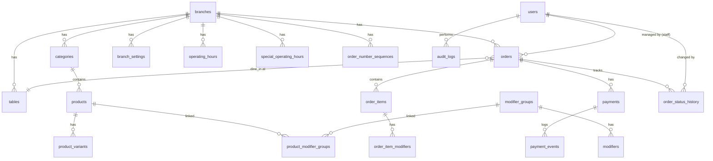

# Database Schema

## Philanthroffee Ordering System — PostgreSQL

> Full ERD and schema definitions. Part of the Technical Specification.

---

## Entity Relationship Diagram



---

## Schema Definitions

### `branches`

```sql
CREATE TABLE branches (
    id              UUID PRIMARY KEY DEFAULT gen_random_uuid(),
    name            VARCHAR(100) NOT NULL,
    slug            VARCHAR(50) NOT NULL UNIQUE,
    address         TEXT,
    phone           VARCHAR(20),
    is_active       BOOLEAN NOT NULL DEFAULT true,
    ordering_paused BOOLEAN NOT NULL DEFAULT false,
    dine_in_enabled BOOLEAN NOT NULL DEFAULT true,
    pickup_enabled  BOOLEAN NOT NULL DEFAULT true,
    default_prep_time_minutes INTEGER NOT NULL DEFAULT 8,
    created_at      TIMESTAMPTZ NOT NULL DEFAULT NOW(),
    updated_at      TIMESTAMPTZ NOT NULL DEFAULT NOW()
);
```

### `users`

```sql
CREATE TABLE users (
    id              UUID PRIMARY KEY REFERENCES auth.users(id) ON DELETE CASCADE,
    branch_id       UUID NOT NULL REFERENCES branches(id),
    email           VARCHAR(255) NOT NULL UNIQUE,
    full_name       VARCHAR(100) NOT NULL,
    role            VARCHAR(20) NOT NULL CHECK (role IN ('OWNER','ADMIN','CASHIER','BARISTA')),
    is_active       BOOLEAN NOT NULL DEFAULT true,
    created_at      TIMESTAMPTZ NOT NULL DEFAULT NOW(),
    updated_at      TIMESTAMPTZ NOT NULL DEFAULT NOW()
);

CREATE INDEX idx_users_branch ON users(branch_id);
CREATE INDEX idx_users_role ON users(role);
```

### `tables`

```sql
CREATE TABLE tables (
    id              UUID PRIMARY KEY DEFAULT gen_random_uuid(),
    branch_id       UUID NOT NULL REFERENCES branches(id),
    table_number    VARCHAR(10) NOT NULL,
    qr_token        VARCHAR(64) NOT NULL UNIQUE,
    status          VARCHAR(20) NOT NULL DEFAULT 'ACTIVE' CHECK (status IN ('ACTIVE','DISABLED')),
    created_at      TIMESTAMPTZ NOT NULL DEFAULT NOW(),
    updated_at      TIMESTAMPTZ NOT NULL DEFAULT NOW(),
    UNIQUE(branch_id, table_number)
);

CREATE INDEX idx_tables_branch ON tables(branch_id);
CREATE INDEX idx_tables_token ON tables(qr_token);
```

### `categories`

```sql
CREATE TABLE categories (
    id              UUID PRIMARY KEY DEFAULT gen_random_uuid(),
    branch_id       UUID NOT NULL REFERENCES branches(id),
    name            VARCHAR(50) NOT NULL,
    slug            VARCHAR(50) NOT NULL,
    sort_order      INTEGER NOT NULL DEFAULT 0,
    is_active       BOOLEAN NOT NULL DEFAULT true,
    created_at      TIMESTAMPTZ NOT NULL DEFAULT NOW(),
    updated_at      TIMESTAMPTZ NOT NULL DEFAULT NOW(),
    UNIQUE(branch_id, slug)
);

CREATE INDEX idx_categories_branch ON categories(branch_id);
```

### `products`

```sql
CREATE TABLE products (
    id              UUID PRIMARY KEY DEFAULT gen_random_uuid(),
    branch_id       UUID NOT NULL REFERENCES branches(id),
    category_id     UUID NOT NULL REFERENCES categories(id),
    name            VARCHAR(100) NOT NULL,
    description     TEXT,
    image_url       TEXT,
    base_price      INTEGER NOT NULL CHECK (base_price >= 0),
    availability    VARCHAR(20) NOT NULL DEFAULT 'AVAILABLE' 
                    CHECK (availability IN ('AVAILABLE','SOLD_OUT','HIDDEN')),
    sort_order      INTEGER NOT NULL DEFAULT 0,
    created_at      TIMESTAMPTZ NOT NULL DEFAULT NOW(),
    updated_at      TIMESTAMPTZ NOT NULL DEFAULT NOW()
);

CREATE INDEX idx_products_branch ON products(branch_id);
CREATE INDEX idx_products_category ON products(category_id);
CREATE INDEX idx_products_availability ON products(availability);
```

### `product_variants`

```sql
CREATE TABLE product_variants (
    id                  UUID PRIMARY KEY DEFAULT gen_random_uuid(),
    product_id          UUID NOT NULL REFERENCES products(id) ON DELETE CASCADE,
    name                VARCHAR(50) NOT NULL,
    price_adjustment    INTEGER NOT NULL DEFAULT 0,
    sort_order          INTEGER NOT NULL DEFAULT 0,
    is_active           BOOLEAN NOT NULL DEFAULT true,
    created_at          TIMESTAMPTZ NOT NULL DEFAULT NOW(),
    updated_at          TIMESTAMPTZ NOT NULL DEFAULT NOW()
);

CREATE INDEX idx_product_variants_product ON product_variants(product_id);
```

### `modifier_groups`

```sql
CREATE TABLE modifier_groups (
    id              UUID PRIMARY KEY DEFAULT gen_random_uuid(),
    branch_id       UUID NOT NULL REFERENCES branches(id),
    name            VARCHAR(50) NOT NULL,
    selection_type  VARCHAR(20) NOT NULL CHECK (selection_type IN ('SINGLE','MULTIPLE')),
    is_required     BOOLEAN NOT NULL DEFAULT false,
    min_selections  INTEGER NOT NULL DEFAULT 0,
    max_selections  INTEGER,
    sort_order      INTEGER NOT NULL DEFAULT 0,
    created_at      TIMESTAMPTZ NOT NULL DEFAULT NOW(),
    updated_at      TIMESTAMPTZ NOT NULL DEFAULT NOW()
);

CREATE INDEX idx_modifier_groups_branch ON modifier_groups(branch_id);
```

### `modifiers`

```sql
CREATE TABLE modifiers (
    id                  UUID PRIMARY KEY DEFAULT gen_random_uuid(),
    modifier_group_id   UUID NOT NULL REFERENCES modifier_groups(id) ON DELETE CASCADE,
    name                VARCHAR(50) NOT NULL,
    price_adjustment    INTEGER NOT NULL DEFAULT 0,
    sort_order          INTEGER NOT NULL DEFAULT 0,
    is_active           BOOLEAN NOT NULL DEFAULT true,
    created_at          TIMESTAMPTZ NOT NULL DEFAULT NOW(),
    updated_at          TIMESTAMPTZ NOT NULL DEFAULT NOW()
);

CREATE INDEX idx_modifiers_group ON modifiers(modifier_group_id);
```

### `product_modifier_groups`

```sql
CREATE TABLE product_modifier_groups (
    id                  UUID PRIMARY KEY DEFAULT gen_random_uuid(),
    product_id          UUID NOT NULL REFERENCES products(id) ON DELETE CASCADE,
    modifier_group_id   UUID NOT NULL REFERENCES modifier_groups(id) ON DELETE CASCADE,
    sort_order          INTEGER NOT NULL DEFAULT 0,
    UNIQUE(product_id, modifier_group_id)
);

CREATE INDEX idx_pmg_product ON product_modifier_groups(product_id);
CREATE INDEX idx_pmg_modifier_group ON product_modifier_groups(modifier_group_id);
```

### `orders`

```sql
CREATE TABLE orders (
    id                  UUID PRIMARY KEY DEFAULT gen_random_uuid(),
    branch_id           UUID NOT NULL REFERENCES branches(id),
    order_number        VARCHAR(20) NOT NULL UNIQUE,
    order_type          VARCHAR(20) NOT NULL CHECK (order_type IN ('DINE_IN','PICKUP')),
    table_id            UUID REFERENCES tables(id),
    customer_name       VARCHAR(100) NOT NULL,
    customer_phone      VARCHAR(20),
    status              VARCHAR(20) NOT NULL DEFAULT 'WAITING_PAYMENT'
                        CHECK (status IN ('WAITING_PAYMENT','PAID','PREPARING','READY','COMPLETED','CANCELLED')),
    subtotal            INTEGER NOT NULL CHECK (subtotal >= 0),
    total               INTEGER NOT NULL CHECK (total >= 0),
    notes               TEXT,
    idempotency_key     VARCHAR(64) UNIQUE,
    created_at          TIMESTAMPTZ NOT NULL DEFAULT NOW(),
    updated_at          TIMESTAMPTZ NOT NULL DEFAULT NOW(),
    
    CONSTRAINT chk_dine_in_table CHECK (
        (order_type = 'DINE_IN' AND table_id IS NOT NULL) OR
        (order_type = 'PICKUP' AND table_id IS NULL)
    )
);

CREATE INDEX idx_orders_branch ON orders(branch_id);
CREATE INDEX idx_orders_status ON orders(status);
CREATE INDEX idx_orders_number ON orders(order_number);
CREATE INDEX idx_orders_table ON orders(table_id);
CREATE INDEX idx_orders_created ON orders(created_at DESC);
CREATE INDEX idx_orders_branch_status ON orders(branch_id, status);
```

### `order_items`

```sql
CREATE TABLE order_items (
    id                      UUID PRIMARY KEY DEFAULT gen_random_uuid(),
    order_id                UUID NOT NULL REFERENCES orders(id) ON DELETE CASCADE,
    product_id              UUID REFERENCES products(id),
    product_variant_id      UUID REFERENCES product_variants(id),
    
    -- Snapshots (immutable after creation)
    product_name_snapshot   VARCHAR(100) NOT NULL,
    variant_name_snapshot   VARCHAR(50),
    base_price_snapshot     INTEGER NOT NULL,
    variant_price_snapshot  INTEGER NOT NULL DEFAULT 0,
    
    quantity                INTEGER NOT NULL CHECK (quantity > 0),
    unit_price              INTEGER NOT NULL CHECK (unit_price >= 0),
    subtotal                INTEGER NOT NULL CHECK (subtotal >= 0),
    notes                   TEXT,
    created_at              TIMESTAMPTZ NOT NULL DEFAULT NOW()
);

CREATE INDEX idx_order_items_order ON order_items(order_id);
```

### `order_item_modifiers`

```sql
CREATE TABLE order_item_modifiers (
    id                          UUID PRIMARY KEY DEFAULT gen_random_uuid(),
    order_item_id               UUID NOT NULL REFERENCES order_items(id) ON DELETE CASCADE,
    modifier_id                 UUID REFERENCES modifiers(id),
    modifier_group_id           UUID REFERENCES modifier_groups(id),
    
    -- Snapshots
    modifier_name_snapshot      VARCHAR(50) NOT NULL,
    modifier_group_name_snapshot VARCHAR(50) NOT NULL,
    price_adjustment_snapshot   INTEGER NOT NULL DEFAULT 0,
    
    created_at                  TIMESTAMPTZ NOT NULL DEFAULT NOW()
);

CREATE INDEX idx_oim_order_item ON order_item_modifiers(order_item_id);
```

### `payments`

```sql
CREATE TABLE payments (
    id                          UUID PRIMARY KEY DEFAULT gen_random_uuid(),
    order_id                    UUID NOT NULL REFERENCES orders(id),
    payment_method              VARCHAR(20) NOT NULL 
                                CHECK (payment_method IN ('QRIS','E_WALLET','PAY_AT_CASHIER')),
    status                      VARCHAR(20) NOT NULL DEFAULT 'PENDING'
                                CHECK (status IN ('PENDING','PAID','FAILED','EXPIRED','REFUNDED')),
    amount                      INTEGER NOT NULL CHECK (amount > 0),
    provider_transaction_id     VARCHAR(100) UNIQUE,
    provider_status             VARCHAR(50),
    snap_token                  TEXT,
    payment_url                 TEXT,
    paid_at                     TIMESTAMPTZ,
    expired_at                  TIMESTAMPTZ,
    confirmed_by                UUID REFERENCES users(id),
    last_reconciled_at          TIMESTAMPTZ,
    created_at                  TIMESTAMPTZ NOT NULL DEFAULT NOW(),
    updated_at                  TIMESTAMPTZ NOT NULL DEFAULT NOW()
);

CREATE INDEX idx_payments_order ON payments(order_id);
CREATE INDEX idx_payments_status ON payments(status);
CREATE INDEX idx_payments_provider_tx ON payments(provider_transaction_id);
CREATE INDEX idx_payments_pending ON payments(status, created_at) WHERE status = 'PENDING';
```

### `payment_events`

```sql
CREATE TABLE payment_events (
    id                      UUID PRIMARY KEY DEFAULT gen_random_uuid(),
    payment_id              UUID NOT NULL REFERENCES payments(id),
    event_type              VARCHAR(50) NOT NULL,
    provider_status         VARCHAR(50),
    raw_payload             JSONB,
    source                  VARCHAR(20) NOT NULL CHECK (source IN ('WEBHOOK','RECONCILIATION','MANUAL','SYSTEM')),
    created_at              TIMESTAMPTZ NOT NULL DEFAULT NOW()
);

CREATE INDEX idx_payment_events_payment ON payment_events(payment_id);
CREATE INDEX idx_payment_events_type ON payment_events(event_type);
```

### `order_status_history`

```sql
CREATE TABLE order_status_history (
    id              UUID PRIMARY KEY DEFAULT gen_random_uuid(),
    order_id        UUID NOT NULL REFERENCES orders(id) ON DELETE CASCADE,
    from_status     VARCHAR(20),
    to_status       VARCHAR(20) NOT NULL,
    changed_by      UUID REFERENCES users(id),
    source          VARCHAR(20) NOT NULL DEFAULT 'SYSTEM'
                    CHECK (source IN ('SYSTEM','STAFF','WEBHOOK','RECONCILIATION')),
    notes           TEXT,
    created_at      TIMESTAMPTZ NOT NULL DEFAULT NOW()
);

CREATE INDEX idx_osh_order ON order_status_history(order_id);
CREATE INDEX idx_osh_created ON order_status_history(created_at);
```

### `order_number_sequences`

```sql
CREATE TABLE order_number_sequences (
    id              UUID PRIMARY KEY DEFAULT gen_random_uuid(),
    branch_id       UUID NOT NULL REFERENCES branches(id),
    order_date      DATE NOT NULL,
    last_number     INTEGER NOT NULL DEFAULT 0,
    UNIQUE(branch_id, order_date)
);
```

### `branch_settings`

```sql
CREATE TABLE branch_settings (
    id              UUID PRIMARY KEY DEFAULT gen_random_uuid(),
    branch_id       UUID NOT NULL REFERENCES branches(id) UNIQUE,
    timezone        VARCHAR(50) NOT NULL DEFAULT 'Asia/Jakarta',
    currency        VARCHAR(3) NOT NULL DEFAULT 'IDR',
    tax_rate        DECIMAL(5,2) NOT NULL DEFAULT 0,
    tax_included    BOOLEAN NOT NULL DEFAULT true,
    receipt_header  TEXT,
    receipt_footer  TEXT,
    created_at      TIMESTAMPTZ NOT NULL DEFAULT NOW(),
    updated_at      TIMESTAMPTZ NOT NULL DEFAULT NOW()
);
```

### `operating_hours`

```sql
CREATE TABLE operating_hours (
    id              UUID PRIMARY KEY DEFAULT gen_random_uuid(),
    branch_id       UUID NOT NULL REFERENCES branches(id),
    day_of_week     INTEGER NOT NULL CHECK (day_of_week BETWEEN 0 AND 6),
    open_time       TIME NOT NULL,
    close_time      TIME NOT NULL,
    is_closed       BOOLEAN NOT NULL DEFAULT false,
    UNIQUE(branch_id, day_of_week)
);

CREATE INDEX idx_operating_hours_branch ON operating_hours(branch_id);
```

### `special_operating_hours`

```sql
CREATE TABLE special_operating_hours (
    id              UUID PRIMARY KEY DEFAULT gen_random_uuid(),
    branch_id       UUID NOT NULL REFERENCES branches(id),
    date            DATE NOT NULL,
    open_time       TIME,
    close_time      TIME,
    is_closed       BOOLEAN NOT NULL DEFAULT false,
    reason          VARCHAR(200),
    UNIQUE(branch_id, date)
);

CREATE INDEX idx_special_hours_branch ON special_operating_hours(branch_id);
CREATE INDEX idx_special_hours_date ON special_operating_hours(date);
```

### `idempotency_keys`

```sql
CREATE TABLE idempotency_keys (
    id              UUID PRIMARY KEY DEFAULT gen_random_uuid(),
    key             VARCHAR(64) NOT NULL UNIQUE,
    endpoint        VARCHAR(100) NOT NULL,
    response_status INTEGER NOT NULL,
    response_body   JSONB NOT NULL,
    created_at      TIMESTAMPTZ NOT NULL DEFAULT NOW(),
    expires_at      TIMESTAMPTZ NOT NULL DEFAULT NOW() + INTERVAL '24 hours'
);

CREATE INDEX idx_idempotency_key ON idempotency_keys(key);
CREATE INDEX idx_idempotency_expires ON idempotency_keys(expires_at);
```

### `audit_logs`

```sql
CREATE TABLE audit_logs (
    id              UUID PRIMARY KEY DEFAULT gen_random_uuid(),
    user_id         UUID REFERENCES users(id),
    action          VARCHAR(50) NOT NULL,
    entity_type     VARCHAR(50) NOT NULL,
    entity_id       UUID,
    old_value       JSONB,
    new_value       JSONB,
    ip_address      INET,
    user_agent      TEXT,
    created_at      TIMESTAMPTZ NOT NULL DEFAULT NOW()
);

CREATE INDEX idx_audit_user ON audit_logs(user_id);
CREATE INDEX idx_audit_action ON audit_logs(action);
CREATE INDEX idx_audit_entity ON audit_logs(entity_type, entity_id);
CREATE INDEX idx_audit_created ON audit_logs(created_at DESC);
```

---

## PostgreSQL Functions

### `next_order_number`

```sql
CREATE OR REPLACE FUNCTION next_order_number(p_branch_id UUID, p_date DATE)
RETURNS INTEGER AS $$
DECLARE
    next_num INTEGER;
BEGIN
    INSERT INTO order_number_sequences (branch_id, order_date, last_number)
    VALUES (p_branch_id, p_date, 1)
    ON CONFLICT (branch_id, order_date)
    DO UPDATE SET last_number = order_number_sequences.last_number + 1
    RETURNING last_number INTO next_num;
    
    RETURN next_num;
END;
$$ LANGUAGE plpgsql;
```

### `validate_order_transition`

```sql
CREATE OR REPLACE FUNCTION validate_order_transition()
RETURNS TRIGGER AS $$
BEGIN
    IF OLD.status = NEW.status THEN
        RETURN NEW;
    END IF;
    
    IF NOT (
        (OLD.status = 'WAITING_PAYMENT' AND NEW.status IN ('PAID', 'CANCELLED')) OR
        (OLD.status = 'PAID' AND NEW.status IN ('PREPARING', 'CANCELLED')) OR
        (OLD.status = 'PREPARING' AND NEW.status = 'READY') OR
        (OLD.status = 'READY' AND NEW.status = 'COMPLETED')
    ) THEN
        RAISE EXCEPTION 'Invalid order status transition: % → %', OLD.status, NEW.status;
    END IF;
    
    NEW.updated_at = NOW();
    RETURN NEW;
END;
$$ LANGUAGE plpgsql;

CREATE TRIGGER trg_validate_order_transition
    BEFORE UPDATE OF status ON orders
    FOR EACH ROW
    EXECUTE FUNCTION validate_order_transition();
```

### `validate_payment_transition`

```sql
CREATE OR REPLACE FUNCTION validate_payment_transition()
RETURNS TRIGGER AS $$
BEGIN
    IF OLD.status = NEW.status THEN
        RETURN NEW;
    END IF;
    
    IF NOT (
        (OLD.status = 'PENDING' AND NEW.status IN ('PAID', 'FAILED', 'EXPIRED')) OR
        (OLD.status = 'PAID' AND NEW.status = 'REFUNDED')
    ) THEN
        RAISE EXCEPTION 'Invalid payment status transition: % → %', OLD.status, NEW.status;
    END IF;
    
    IF NEW.status = 'PAID' THEN
        NEW.paid_at = NOW();
    END IF;
    
    NEW.updated_at = NOW();
    RETURN NEW;
END;
$$ LANGUAGE plpgsql;

CREATE TRIGGER trg_validate_payment_transition
    BEFORE UPDATE OF status ON payments
    FOR EACH ROW
    EXECUTE FUNCTION validate_payment_transition();
```

### `auto_update_timestamp`

```sql
CREATE OR REPLACE FUNCTION update_updated_at()
RETURNS TRIGGER AS $$
BEGIN
    NEW.updated_at = NOW();
    RETURN NEW;
END;
$$ LANGUAGE plpgsql;

-- Apply to all tables with updated_at
CREATE TRIGGER trg_update_branches_timestamp BEFORE UPDATE ON branches FOR EACH ROW EXECUTE FUNCTION update_updated_at();
CREATE TRIGGER trg_update_users_timestamp BEFORE UPDATE ON users FOR EACH ROW EXECUTE FUNCTION update_updated_at();
CREATE TRIGGER trg_update_tables_timestamp BEFORE UPDATE ON tables FOR EACH ROW EXECUTE FUNCTION update_updated_at();
CREATE TRIGGER trg_update_categories_timestamp BEFORE UPDATE ON categories FOR EACH ROW EXECUTE FUNCTION update_updated_at();
CREATE TRIGGER trg_update_products_timestamp BEFORE UPDATE ON products FOR EACH ROW EXECUTE FUNCTION update_updated_at();
CREATE TRIGGER trg_update_product_variants_timestamp BEFORE UPDATE ON product_variants FOR EACH ROW EXECUTE FUNCTION update_updated_at();
CREATE TRIGGER trg_update_modifier_groups_timestamp BEFORE UPDATE ON modifier_groups FOR EACH ROW EXECUTE FUNCTION update_updated_at();
CREATE TRIGGER trg_update_modifiers_timestamp BEFORE UPDATE ON modifiers FOR EACH ROW EXECUTE FUNCTION update_updated_at();
CREATE TRIGGER trg_update_branch_settings_timestamp BEFORE UPDATE ON branch_settings FOR EACH ROW EXECUTE FUNCTION update_updated_at();
```

### `cleanup_expired_idempotency_keys`

```sql
-- Run periodically via pg_cron or external scheduler
CREATE OR REPLACE FUNCTION cleanup_expired_idempotency_keys()
RETURNS void AS $$
BEGIN
    DELETE FROM idempotency_keys WHERE expires_at < NOW();
END;
$$ LANGUAGE plpgsql;
```

---

## Row Level Security (RLS)

```sql
-- Enable RLS on all tables
ALTER TABLE branches ENABLE ROW LEVEL SECURITY;
ALTER TABLE users ENABLE ROW LEVEL SECURITY;
ALTER TABLE tables ENABLE ROW LEVEL SECURITY;
ALTER TABLE categories ENABLE ROW LEVEL SECURITY;
ALTER TABLE products ENABLE ROW LEVEL SECURITY;
ALTER TABLE orders ENABLE ROW LEVEL SECURITY;
ALTER TABLE payments ENABLE ROW LEVEL SECURITY;

-- Public read for menu (anon users)
CREATE POLICY "Anyone can read active categories"
    ON categories FOR SELECT
    USING (is_active = true);

CREATE POLICY "Anyone can read available products"
    ON products FOR SELECT
    USING (availability IN ('AVAILABLE', 'SOLD_OUT'));

-- Staff policies
CREATE POLICY "Staff can read own branch data"
    ON orders FOR SELECT
    USING (
        branch_id IN (
            SELECT branch_id FROM users WHERE id = auth.uid()
        )
    );

CREATE POLICY "Staff can update own branch orders"
    ON orders FOR UPDATE
    USING (
        branch_id IN (
            SELECT branch_id FROM users WHERE id = auth.uid()
        )
    );
```

---

## Seed Data

```sql
-- Default branch
INSERT INTO branches (id, name, slug) VALUES 
    ('00000000-0000-0000-0000-000000000001', 'Philanthroffee', 'philanthroffee');

-- Default operating hours (Mon-Sun, 08:00-22:00)
INSERT INTO operating_hours (branch_id, day_of_week, open_time, close_time) VALUES
    ('00000000-0000-0000-0000-000000000001', 0, '08:00', '22:00'),
    ('00000000-0000-0000-0000-000000000001', 1, '08:00', '22:00'),
    ('00000000-0000-0000-0000-000000000001', 2, '08:00', '22:00'),
    ('00000000-0000-0000-0000-000000000001', 3, '08:00', '22:00'),
    ('00000000-0000-0000-0000-000000000001', 4, '08:00', '22:00'),
    ('00000000-0000-0000-0000-000000000001', 5, '09:00', '23:00'),
    ('00000000-0000-0000-0000-000000000001', 6, '09:00', '23:00');

-- Default branch settings
INSERT INTO branch_settings (branch_id) VALUES 
    ('00000000-0000-0000-0000-000000000001');

-- Sample categories
INSERT INTO categories (branch_id, name, slug, sort_order) VALUES
    ('00000000-0000-0000-0000-000000000001', 'Coffee', 'coffee', 1),
    ('00000000-0000-0000-0000-000000000001', 'Non Coffee', 'non-coffee', 2),
    ('00000000-0000-0000-0000-000000000001', 'Tea', 'tea', 3),
    ('00000000-0000-0000-0000-000000000001', 'Herbs & Spices', 'herbs-spices', 4),
    ('00000000-0000-0000-0000-000000000001', 'Food', 'food', 5),
    ('00000000-0000-0000-0000-000000000001', 'Snack', 'snack', 6);
```
