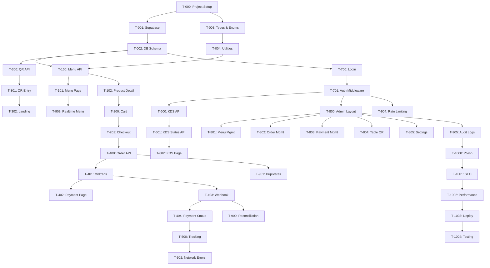

# Task Breakdown

## Philanthroffee Ordering System — Implementation Plan

> Ordered implementation tasks for MVP development.
> Each task is atomic and independently deployable.

---

## Phase 0: Project Setup

### T-000: Initialize Nuxt 4 Project
- [x] `npx -y nuxi@latest init ./`
- [x] Configure `nuxt.config.ts` (Tailwind, Nuxt UI, TypeScript)
- [x] Setup Tailwind CSS
- [x] Setup Nuxt UI
- [x] Configure app metadata (title, description, favicon)
- [x] Add Google Fonts (Inter/Outfit)
- [x] Create base layout

### T-001: Supabase Setup
- [x] Create Supabase project
- [x] Configure environment variables (`.env`)
- [x] Install `@supabase/supabase-js`
- [x] Create server-side Supabase client utility (`server/utils/supabase.ts`)
- [x] Create client-side Supabase composable (`composables/useSupabase.ts`)
- [x] Configure Supabase Auth for staff

### T-002: Database Schema Migration
- [x] Run full schema SQL from `DATABASE-SCHEMA.md`
- [x] Create all tables
- [x] Create indexes
- [x] Create triggers (order/payment transition validation)
- [x] Create functions (`next_order_number`, `validate_order_transition`, etc.)
- [x] Setup RLS policies
- [x] Run seed data (branch, categories, operating hours)
- [x] Verify with test queries

### T-003: TypeScript Types & Enums
- [x] Create `types/order.ts` (OrderStatus, OrderType, enums)
- [x] Create `types/product.ts` (ProductAvailability, variants, modifiers)
- [x] Create `types/payment.ts` (PaymentStatus, PaymentMethod)
- [x] Create `types/table.ts` (TableStatus)
- [x] Create `types/user.ts` (UserRole)
- [x] Create `types/settings.ts`
- [x] Create `types/api.ts` (ApiResponse, ApiError)
- [x] Create `utils/constants.ts` (transition maps, validation rules)

### T-004: Shared Utilities
- [x] Create `utils/currency.ts` (Rp formatting)
- [x] Create `utils/date.ts` (relative time, formatted date)
- [x] Create `server/utils/validation.ts` (Zod schemas)
- [x] Create `server/utils/auth.ts` (middleware helpers)
- [x] Create `server/utils/idempotency.ts`
- [x] Create `server/utils/price-calculator.ts`
- [x] Create `server/utils/order-number.ts`

---

## Phase 1: Menu & Product (Customer-facing)

### T-100: Menu API
- [x] `GET /api/menu` — fetch categories + products
- [x] `GET /api/menu/:id` — fetch product detail with variants & modifiers
- [x] Server-side filtering (only AVAILABLE + SOLD_OUT)
- [x] Include category grouping
- [x] Unit tests

### T-101: Menu Page
- [x] `pages/menu/index.vue`
- [x] `components/menu/CategoryTabs.vue` — horizontal scrollable tabs
- [x] `components/menu/ProductCard.vue` — product grid card
- [x] `components/menu/ProductBadge.vue` — sold out badge
- [x] Sold out visual treatment (greyed out, not clickable)
- [x] `composables/useMenu.ts`
- [x] Loading states & empty states
- [x] Responsive design (mobile-first)

### T-102: Product Detail Page
- [x] `pages/product/[id].vue`
- [x] `components/product/VariantSelector.vue` — radio buttons for variants
- [x] `components/product/ModifierGroup.vue` — single/multi select
- [x] `components/product/NotesInput.vue` — free text
- [x] Dynamic price calculation (base + variant + modifiers)
- [x] Add to cart button with quantity
- [x] Validation (required modifiers selected)

---

## Phase 2: Cart & Checkout

### T-200: Cart System
- [x] `composables/useCart.ts`
  - [x] Add item (with variant + modifiers + notes)
  - [x] Remove item
  - [x] Update quantity
  - [x] Edit item
  - [x] Calculate totals
  - [x] localStorage persistence
  - [x] Auto-expire after 4 hours
- [x] `components/cart/CartFloatingBar.vue` — sticky bottom bar on menu
- [x] `pages/cart/index.vue` — full cart review
- [x] `components/cart/CartItem.vue` — item with modifiers display
- [x] `components/cart/CartSummary.vue` — subtotal, total

### T-201: Checkout Page
- [x] `pages/checkout/index.vue`
- [x] Order type display (Dine In + table / Pickup)
- [x] Customer name input (required)
- [x] Customer phone input (optional)
- [x] `components/checkout/OrderSummary.vue`
- [x] `components/checkout/PaymentMethodSelector.vue` (QRIS, E-Wallet, Pay at Cashier)
- [x] Total confirmation
- [x] "Bayar" button with loading state

---

## Phase 3: QR Table & Entry Points

### T-300: QR Table Verification API
- [x] `POST /api/tables/verify` — validate table_number + token
- [x] Handle invalid token (404)
- [x] Handle disabled table (403)

### T-301: QR Entry Page
- [x] `pages/t/[tableNumber].vue`
- [x] Extract token from query param
- [x] Call verify API
- [x] On success: set cart orderType=DINE_IN, tableId, tableNumber
- [x] Redirect to menu
- [x] Error states (invalid QR, disabled table)
- [x] `composables/useTable.ts`

### T-302: Landing Page
- [x] `pages/index.vue`
- [x] Dine In / Pickup selector
- [x] For Dine In without QR: "Scan QR di mejamu"
- [x] For Pickup: set orderType=PICKUP, redirect to menu
- [x] Branch open/closed check
- [x] Ordering paused message

---

## Phase 4: Order Creation & Payment

### T-400: Order Creation API
- [x] `POST /api/orders`
- [x] Idempotency key handling
- [x] Server-side price recalculation
- [x] Price mismatch detection → 409
- [x] Availability check → 422
- [x] Snapshot creation (product name, prices, modifiers)
- [x] Order number generation
- [x] Order status history entry
- [x] Return full order detail

### T-401: Midtrans Integration
- [x] Install Midtrans SDK
- [x] Create `server/utils/midtrans.ts` (client setup)
- [x] `POST /api/payments` — create Midtrans transaction
- [x] Return snap_token for Snap popup
- [x] Handle PAY_AT_CASHIER (no Midtrans call)

### T-402: Payment Page
- [x] `pages/payment/[orderNumber].vue`
- [x] Load Midtrans Snap JS
- [x] Show Snap payment popup (QRIS/E-Wallet)
- [x] For Pay at Cashier: show order number + instructions
- [x] Polling/realtime payment status check
- [x] Redirect to tracking on success

### T-403: Midtrans Webhook
- [x] `POST /api/payments/midtrans/webhook`
- [x] Signature verification
- [x] Status mapping (settlement → PAID, etc.)
- [x] Idempotent processing (check payment_events)
- [x] Update payment status
- [x] Update order status
- [x] Store payment event
- [x] Return 200 always

### T-404: Payment Status API
- [x] `GET /api/payments/:orderNumber/status`
- [x] Return payment + order status
- [x] Rate limited

---

## Phase 5: Order Tracking (Customer)

### T-500: Order Tracking Page
- [x] `pages/order/[orderNumber].vue`
- [x] `components/order/OrderTimeline.vue` — visual status timeline
- [x] `components/order/OrderStatusBadge.vue`
- [x] Show order items summary
- [x] Show estimated ready time
- [x] Realtime subscription for status updates
- [x] `composables/useOrder.ts`
- [x] `composables/useRealtime.ts`

---

## Phase 6: Barista KDS

### T-600: KDS Orders API
- [x] `GET /api/staff/orders?status=PAID,PREPARING,READY`
- [x] Include items, modifiers, notes, elapsed time
- [x] Auth required (BARISTA, ADMIN, OWNER)

### T-601: KDS Status Update API
- [x] `PATCH /api/staff/orders/:id/status`
- [x] Validate transition (state machine)
- [x] Record status history
- [x] Auth required

### T-602: KDS Page
- [x] `pages/staff/kds.vue`
- [x] 3-column Kanban: BARU | DIBUAT | SIAP
- [x] `components/kds/KdsColumn.vue`
- [x] `components/kds/KdsOrderCard.vue` — order detail card
- [x] `components/kds/KdsTimer.vue` — elapsed time counter
- [x] Action buttons: MULAI BUAT, TANDAI SIAP, SELESAIKAN
- [x] Realtime subscription for new orders
- [x] Audio notification for new orders
- [x] Auto-refresh fallback

---

## Phase 7: Staff Auth

### T-700: Staff Login
- [x] `pages/staff/login.vue`
- [x] Email + password login via Supabase Auth
- [x] Redirect based on role (BARISTA → KDS, ADMIN → dashboard)
- [x] `composables/useAuth.ts`

### T-701: Auth Middleware
- [x] `server/utils/auth.ts` — requireAuth, requireRole
- [x] Protect all `/api/staff/*` endpoints
- [x] RBAC check per endpoint

---

## Phase 8: Admin Dashboard

### T-800: Admin Layout
- [x] `pages/admin/index.vue`
- [x] Sidebar navigation
- [x] Quick stats (today's orders, revenue, pending payments)
- [x] Responsive layout

### T-801: Menu Management
- [x] `pages/admin/menu/index.vue` — product list
- [x] `pages/admin/menu/[id].vue` — product edit
- [x] `components/admin/ProductForm.vue`
- [x] CRUD APIs for products
- [x] Category management page
- [x] Image upload (Supabase Storage)
- [x] Sold out toggle
- [x] Availability management

### T-802: Order Management
- [x] `pages/admin/orders/index.vue` — filterable order list
- [x] `pages/admin/orders/[id].vue` — order detail with timeline
- [x] `components/admin/OrderTable.vue`
- [x] Filter by status, payment, date, type
- [x] Search by order number / customer name

### T-803: Payment Management
- [x] `pages/admin/payments/index.vue`
- [x] `components/admin/PaymentTable.vue`
- [x] `components/admin/ReconciliationAlert.vue`
- [x] Cash payment confirmation (cashier)
- [x] Reconciliation trigger button
- [x] `POST /api/staff/admin/payments/:id/reconcile`

### T-804: Table & QR Management
- [x] `pages/admin/tables/index.vue`
- [x] `components/admin/TableQrCard.vue`
- [x] Add/edit/disable tables
- [x] Generate QR code (client-side using `qrcode` library)
- [x] Regenerate token
- [x] Download QR as PNG
- [x] Print QR card layout
- [x] Copy URL

### T-805: Settings
- [x] `pages/admin/settings/index.vue`
- [x] Ordering paused toggle
- [x] Dine in / Pickup toggles
- [x] Preparation time setting
- [x] Operating hours management
- [x] `PATCH /api/staff/admin/settings`

---

## Phase 9: Edge Cases & Hardening

### T-900: Payment Recovery
- [x] Background reconciliation task
- [x] Check PENDING payments older than 5 minutes
- [x] Query Midtrans transaction status
- [x] Auto-fix mismatches
- [x] Log reconciliation events

### T-901: Duplicate Prevention
- [x] Idempotency key table + middleware
- [x] Frontend: disable button on submit
- [x] Frontend: store idempotency key in session

### T-902: Network Error Handling
- [x] Cart persistence (localStorage verified)
- [x] Order number storage after creation
- [x] "Jangan bayar ulang" warning screen
- [x] Reconnection detection + status refresh
- [x] `components/shared/ErrorBoundary.vue`

### T-903: Menu Availability Realtime
- [x] Supabase Realtime subscription on products table
- [x] Auto-update sold out status on menu page
- [x] Block add-to-cart if sold out

### T-904: Rate Limiting
- [x] Implement rate limiter middleware
- [x] Apply to critical endpoints (see TECH-SPEC.md §8.1)

### T-905: Audit Logging
- [x] Create audit log utility
- [x] Log all critical admin actions
- [x] Audit log viewer (admin)

---

## Phase 10: Polish & Deploy

### T-1000: UI/UX Polish
- [x] Loading skeletons for all pages
- [x] Toast notifications
- [x] Smooth transitions/animations
- [x] Empty states for all lists
- [x] Confirm dialogs for destructive actions
- [x] Mobile responsive testing

### T-1001: SEO & Meta
- [x] Page titles
- [x] Meta descriptions
- [x] Open Graph tags
- [x] Favicon

### T-1002: Performance
- [x] Image optimization (Supabase transforms)
- [x] API response caching where appropriate
- [x] Bundle analysis
- [x] Lighthouse audit

### T-1003: Deployment
- [x] Vercel project setup
- [x] Environment variables configuration
- [x] Custom domain setup
- [x] Midtrans production credentials
- [x] Supabase production setup
- [x] SSL verification
- [x] Webhook URL registration with Midtrans

### T-1004: Acceptance Testing
- [x] Run through all 15 acceptance criteria from PRD §85
- [x] Customer flow end-to-end
- [x] Payment flow (QRIS + cash)
- [x] KDS workflow
- [x] Admin operations
- [x] Error recovery scenarios

---

## Task Dependency Graph

---

## Estimated Timeline (1 developer)

| Phase | Tasks | Est. Days |
|---|---|---|
| 0: Setup | T-000 to T-004 | 2-3 |
| 1: Menu | T-100 to T-102 | 3-4 |
| 2: Cart | T-200 to T-201 | 2-3 |
| 3: QR Entry | T-300 to T-302 | 1-2 |
| 4: Order & Payment | T-400 to T-404 | 4-5 |
| 5: Tracking | T-500 | 1-2 |
| 6: KDS | T-600 to T-602 | 3-4 |
| 7: Auth | T-700 to T-701 | 1-2 |
| 8: Admin | T-800 to T-805 | 5-7 |
| 9: Hardening | T-900 to T-905 | 3-4 |
| 10: Deploy | T-1000 to T-1004 | 3-4 |
| **Total** | **~40 tasks** | **~28-40 days** |
