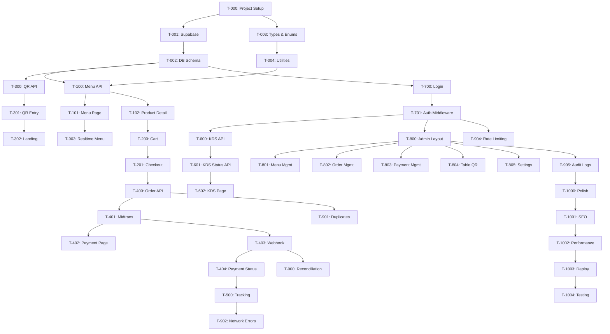

# Task Breakdown

## Philanthroffee Ordering System — Implementation Plan

> Ordered implementation tasks for MVP development.
> Each task is atomic and independently deployable.

---

## Phase 0: Project Setup

### T-000: Initialize Nuxt 4 Project
- [ ] `npx -y nuxi@latest init ./`
- [ ] Configure `nuxt.config.ts` (Tailwind, Nuxt UI, TypeScript)
- [ ] Setup Tailwind CSS
- [ ] Setup Nuxt UI
- [ ] Configure app metadata (title, description, favicon)
- [ ] Add Google Fonts (Inter/Outfit)
- [ ] Create base layout

### T-001: Supabase Setup
- [ ] Create Supabase project
- [ ] Configure environment variables (`.env`)
- [ ] Install `@supabase/supabase-js`
- [ ] Create server-side Supabase client utility (`server/utils/supabase.ts`)
- [ ] Create client-side Supabase composable (`composables/useSupabase.ts`)
- [ ] Configure Supabase Auth for staff

### T-002: Database Schema Migration
- [ ] Run full schema SQL from `DATABASE-SCHEMA.md`
- [ ] Create all tables
- [ ] Create indexes
- [ ] Create triggers (order/payment transition validation)
- [ ] Create functions (`next_order_number`, `validate_order_transition`, etc.)
- [ ] Setup RLS policies
- [ ] Run seed data (branch, categories, operating hours)
- [ ] Verify with test queries

### T-003: TypeScript Types & Enums
- [ ] Create `types/order.ts` (OrderStatus, OrderType, enums)
- [ ] Create `types/product.ts` (ProductAvailability, variants, modifiers)
- [ ] Create `types/payment.ts` (PaymentStatus, PaymentMethod)
- [ ] Create `types/table.ts` (TableStatus)
- [ ] Create `types/user.ts` (UserRole)
- [ ] Create `types/settings.ts`
- [ ] Create `types/api.ts` (ApiResponse, ApiError)
- [ ] Create `utils/constants.ts` (transition maps, validation rules)

### T-004: Shared Utilities
- [ ] Create `utils/currency.ts` (Rp formatting)
- [ ] Create `utils/date.ts` (relative time, formatted date)
- [ ] Create `server/utils/validation.ts` (Zod schemas)
- [ ] Create `server/utils/auth.ts` (middleware helpers)
- [ ] Create `server/utils/idempotency.ts`
- [ ] Create `server/utils/price-calculator.ts`
- [ ] Create `server/utils/order-number.ts`

---

## Phase 1: Menu & Product (Customer-facing)

### T-100: Menu API
- [ ] `GET /api/menu` — fetch categories + products
- [ ] `GET /api/menu/:id` — fetch product detail with variants & modifiers
- [ ] Server-side filtering (only AVAILABLE + SOLD_OUT)
- [ ] Include category grouping
- [ ] Unit tests

### T-101: Menu Page
- [ ] `pages/menu/index.vue`
- [ ] `components/menu/CategoryTabs.vue` — horizontal scrollable tabs
- [ ] `components/menu/ProductCard.vue` — product grid card
- [ ] `components/menu/ProductBadge.vue` — sold out badge
- [ ] Sold out visual treatment (greyed out, not clickable)
- [ ] `composables/useMenu.ts`
- [ ] Loading states & empty states
- [ ] Responsive design (mobile-first)

### T-102: Product Detail Page
- [ ] `pages/product/[id].vue`
- [ ] `components/product/VariantSelector.vue` — radio buttons for variants
- [ ] `components/product/ModifierGroup.vue` — single/multi select
- [ ] `components/product/NotesInput.vue` — free text
- [ ] Dynamic price calculation (base + variant + modifiers)
- [ ] Add to cart button with quantity
- [ ] Validation (required modifiers selected)

---

## Phase 2: Cart & Checkout

### T-200: Cart System
- [ ] `composables/useCart.ts`
  - [ ] Add item (with variant + modifiers + notes)
  - [ ] Remove item
  - [ ] Update quantity
  - [ ] Edit item
  - [ ] Calculate totals
  - [ ] localStorage persistence
  - [ ] Auto-expire after 4 hours
- [ ] `components/cart/CartFloatingBar.vue` — sticky bottom bar on menu
- [ ] `pages/cart/index.vue` — full cart review
- [ ] `components/cart/CartItem.vue` — item with modifiers display
- [ ] `components/cart/CartSummary.vue` — subtotal, total

### T-201: Checkout Page
- [ ] `pages/checkout/index.vue`
- [ ] Order type display (Dine In + table / Pickup)
- [ ] Customer name input (required)
- [ ] Customer phone input (optional)
- [ ] `components/checkout/OrderSummary.vue`
- [ ] `components/checkout/PaymentMethodSelector.vue` (QRIS, E-Wallet, Pay at Cashier)
- [ ] Total confirmation
- [ ] "Bayar" button with loading state

---

## Phase 3: QR Table & Entry Points

### T-300: QR Table Verification API
- [ ] `POST /api/tables/verify` — validate table_number + token
- [ ] Handle invalid token (404)
- [ ] Handle disabled table (403)

### T-301: QR Entry Page
- [ ] `pages/t/[tableNumber].vue`
- [ ] Extract token from query param
- [ ] Call verify API
- [ ] On success: set cart orderType=DINE_IN, tableId, tableNumber
- [ ] Redirect to menu
- [ ] Error states (invalid QR, disabled table)
- [ ] `composables/useTable.ts`

### T-302: Landing Page
- [ ] `pages/index.vue`
- [ ] Dine In / Pickup selector
- [ ] For Dine In without QR: "Scan QR di mejamu"
- [ ] For Pickup: set orderType=PICKUP, redirect to menu
- [ ] Branch open/closed check
- [ ] Ordering paused message

---

## Phase 4: Order Creation & Payment

### T-400: Order Creation API
- [ ] `POST /api/orders`
- [ ] Idempotency key handling
- [ ] Server-side price recalculation
- [ ] Price mismatch detection → 409
- [ ] Availability check → 422
- [ ] Snapshot creation (product name, prices, modifiers)
- [ ] Order number generation
- [ ] Order status history entry
- [ ] Return full order detail

### T-401: Midtrans Integration
- [ ] Install Midtrans SDK
- [ ] Create `server/utils/midtrans.ts` (client setup)
- [ ] `POST /api/payments` — create Midtrans transaction
- [ ] Return snap_token for Snap popup
- [ ] Handle PAY_AT_CASHIER (no Midtrans call)

### T-402: Payment Page
- [ ] `pages/payment/[orderNumber].vue`
- [ ] Load Midtrans Snap JS
- [ ] Show Snap payment popup (QRIS/E-Wallet)
- [ ] For Pay at Cashier: show order number + instructions
- [ ] Polling/realtime payment status check
- [ ] Redirect to tracking on success

### T-403: Midtrans Webhook
- [ ] `POST /api/payments/midtrans/webhook`
- [ ] Signature verification
- [ ] Status mapping (settlement → PAID, etc.)
- [ ] Idempotent processing (check payment_events)
- [ ] Update payment status
- [ ] Update order status
- [ ] Store payment event
- [ ] Return 200 always

### T-404: Payment Status API
- [ ] `GET /api/payments/:orderNumber/status`
- [ ] Return payment + order status
- [ ] Rate limited

---

## Phase 5: Order Tracking (Customer)

### T-500: Order Tracking Page
- [ ] `pages/order/[orderNumber].vue`
- [ ] `components/order/OrderTimeline.vue` — visual status timeline
- [ ] `components/order/OrderStatusBadge.vue`
- [ ] Show order items summary
- [ ] Show estimated ready time
- [ ] Realtime subscription for status updates
- [ ] `composables/useOrder.ts`
- [ ] `composables/useRealtime.ts`

---

## Phase 6: Barista KDS

### T-600: KDS Orders API
- [ ] `GET /api/staff/orders?status=PAID,PREPARING,READY`
- [ ] Include items, modifiers, notes, elapsed time
- [ ] Auth required (BARISTA, ADMIN, OWNER)

### T-601: KDS Status Update API
- [ ] `PATCH /api/staff/orders/:id/status`
- [ ] Validate transition (state machine)
- [ ] Record status history
- [ ] Auth required

### T-602: KDS Page
- [ ] `pages/staff/kds.vue`
- [ ] 3-column Kanban: BARU | DIBUAT | SIAP
- [ ] `components/kds/KdsColumn.vue`
- [ ] `components/kds/KdsOrderCard.vue` — order detail card
- [ ] `components/kds/KdsTimer.vue` — elapsed time counter
- [ ] Action buttons: MULAI BUAT, TANDAI SIAP, SELESAIKAN
- [ ] Realtime subscription for new orders
- [ ] Audio notification for new orders
- [ ] Auto-refresh fallback

---

## Phase 7: Staff Auth

### T-700: Staff Login
- [ ] `pages/staff/login.vue`
- [ ] Email + password login via Supabase Auth
- [ ] Redirect based on role (BARISTA → KDS, ADMIN → dashboard)
- [ ] `composables/useAuth.ts`

### T-701: Auth Middleware
- [ ] `server/utils/auth.ts` — requireAuth, requireRole
- [ ] Protect all `/api/staff/*` endpoints
- [ ] RBAC check per endpoint

---

## Phase 8: Admin Dashboard

### T-800: Admin Layout
- [ ] `pages/admin/index.vue`
- [ ] Sidebar navigation
- [ ] Quick stats (today's orders, revenue, pending payments)
- [ ] Responsive layout

### T-801: Menu Management
- [ ] `pages/admin/menu/index.vue` — product list
- [ ] `pages/admin/menu/[id].vue` — product edit
- [ ] `components/admin/ProductForm.vue`
- [ ] CRUD APIs for products
- [ ] Category management page
- [ ] Image upload (Supabase Storage)
- [ ] Sold out toggle
- [ ] Availability management

### T-802: Order Management
- [ ] `pages/admin/orders/index.vue` — filterable order list
- [ ] `pages/admin/orders/[id].vue` — order detail with timeline
- [ ] `components/admin/OrderTable.vue`
- [ ] Filter by status, payment, date, type
- [ ] Search by order number / customer name

### T-803: Payment Management
- [ ] `pages/admin/payments/index.vue`
- [ ] `components/admin/PaymentTable.vue`
- [ ] `components/admin/ReconciliationAlert.vue`
- [ ] Cash payment confirmation (cashier)
- [ ] Reconciliation trigger button
- [ ] `POST /api/staff/admin/payments/:id/reconcile`

### T-804: Table & QR Management
- [ ] `pages/admin/tables/index.vue`
- [ ] `components/admin/TableQrCard.vue`
- [ ] Add/edit/disable tables
- [ ] Generate QR code (client-side using `qrcode` library)
- [ ] Regenerate token
- [ ] Download QR as PNG
- [ ] Print QR card layout
- [ ] Copy URL

### T-805: Settings
- [ ] `pages/admin/settings/index.vue`
- [ ] Ordering paused toggle
- [ ] Dine in / Pickup toggles
- [ ] Preparation time setting
- [ ] Operating hours management
- [ ] `PATCH /api/staff/admin/settings`

---

## Phase 9: Edge Cases & Hardening

### T-900: Payment Recovery
- [ ] Background reconciliation task
- [ ] Check PENDING payments older than 5 minutes
- [ ] Query Midtrans transaction status
- [ ] Auto-fix mismatches
- [ ] Log reconciliation events

### T-901: Duplicate Prevention
- [ ] Idempotency key table + middleware
- [ ] Frontend: disable button on submit
- [ ] Frontend: store idempotency key in session

### T-902: Network Error Handling
- [ ] Cart persistence (localStorage verified)
- [ ] Order number storage after creation
- [ ] "Jangan bayar ulang" warning screen
- [ ] Reconnection detection + status refresh
- [ ] `components/shared/ErrorBoundary.vue`

### T-903: Menu Availability Realtime
- [ ] Supabase Realtime subscription on products table
- [ ] Auto-update sold out status on menu page
- [ ] Block add-to-cart if sold out

### T-904: Rate Limiting
- [ ] Implement rate limiter middleware
- [ ] Apply to critical endpoints (see TECH-SPEC.md §8.1)

### T-905: Audit Logging
- [ ] Create audit log utility
- [ ] Log all critical admin actions
- [ ] Audit log viewer (admin)

---

## Phase 10: Polish & Deploy

### T-1000: UI/UX Polish
- [ ] Loading skeletons for all pages
- [ ] Toast notifications
- [ ] Smooth transitions/animations
- [ ] Empty states for all lists
- [ ] Confirm dialogs for destructive actions
- [ ] Mobile responsive testing

### T-1001: SEO & Meta
- [ ] Page titles
- [ ] Meta descriptions
- [ ] Open Graph tags
- [ ] Favicon

### T-1002: Performance
- [ ] Image optimization (Supabase transforms)
- [ ] API response caching where appropriate
- [ ] Bundle analysis
- [ ] Lighthouse audit

### T-1003: Deployment
- [ ] Vercel project setup
- [ ] Environment variables configuration
- [ ] Custom domain setup
- [ ] Midtrans production credentials
- [ ] Supabase production setup
- [ ] SSL verification
- [ ] Webhook URL registration with Midtrans

### T-1004: Acceptance Testing
- [ ] Run through all 15 acceptance criteria from PRD §85
- [ ] Customer flow end-to-end
- [ ] Payment flow (QRIS + cash)
- [ ] KDS workflow
- [ ] Admin operations
- [ ] Error recovery scenarios

---

## Task Dependency Graph

---

## Estimated Timeline (1 developer)

| Phase | Tasks | Est. Days |
|---|---|---|
| 0: Setup | T-000 to T-004 | 2-3 |
| 1: Menu | T-100 to T-102 | 3-4 |
| 2: Cart | T-200 to T-201 | 2-3 |
| 3: QR Entry | T-300 to T-302 | 1-2 |
| 4: Order & Payment | T-400 to T-404 | 4-5 |
| 5: Tracking | T-500 | 1-2 |
| 6: KDS | T-600 to T-602 | 3-4 |
| 7: Auth | T-700 to T-701 | 1-2 |
| 8: Admin | T-800 to T-805 | 5-7 |
| 9: Hardening | T-900 to T-905 | 3-4 |
| 10: Deploy | T-1000 to T-1004 | 3-4 |
| **Total** | **~40 tasks** | **~28-40 days** |
